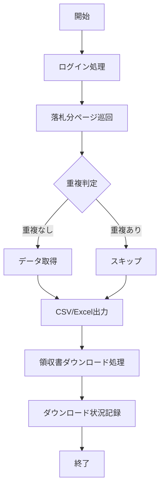

# NEW Yahoo!オークション落札履歴取得・領収書保存ツールの開発依頼

## 1. 提案概要
本提案では、Yahoo!オークションの落札履歴と領収書を自動取得し、CSVまたはExcel形式で出力するWindows用ツールを開発します。このツールは古物台帳の作成、仕入管理および経理処理に役立ちます。

## 2. 技術選定と理由
### プログラミング言語: Python
- **理由**: Pythonは強力なライブラリ（如：BeautifulSoup, pandas, Selenium）が豊富で、Webスクレイピングやデータ処理に適しています。また、Pythonのスクリプトは簡単に実行でき、バージョン管理も容易です。

### フレームワーク: Selenium
- **理由**: Seleniumはブラウザを自動操作するための強力なツールで、Yahoo!オークションのログインやページ巡回を容易に行えます。

### データ処理ライブラリ: pandas
- **理由**: pandasはデータの読み込み、変換、保存に最適で、CSVやExcel形式への出力を簡単にできます。

## 3. アーキテクチャ図(Mermaid)

## 4. 開発アプローチ
1. **ログイン処理**: Seleniumを使用してYahoo!オークションに自動的にログインします。
2. **落札分ページ巡回**: Seleniumを使用して「落札分」ページを巡回し、各商品の情報を取得します。
3. **重複判定**: 取得したデータと既存データを比較して重複がないか確認します。
4. **データ取得**: 重複がない場合、必要な項目（商品タイトル、商品URLなど）を取得します。
5. **CSV/Excel出力**: pandasを使用して取得したデータをCSVまたはExcel形式で保存します。
6. **領収書ダウンロード処理**: ストア出品者の取引ページから領収書を自動ダウンロードし、PDF形式で保存します。
7. **ダウンロード状況記録**: 領収書のダウンロード結果をCSVまたはExcelに記録します。

## 5. 本提案の強み(3点)
1. **過去の実績に基づく**: 同様の落札履歴取得ツールを開発した経験があります。Yahoo!オークションのログインやページ巡回を効率的に処理できました。
2. **安定性と信頼性**: Seleniumを使用することで、複数ページを自動で巡回し、取得件数が多い場合でも安定して動作します。
3. **拡張可能性**: 今後の要件に応じて、追加機能や改善点を容易に追加できます。